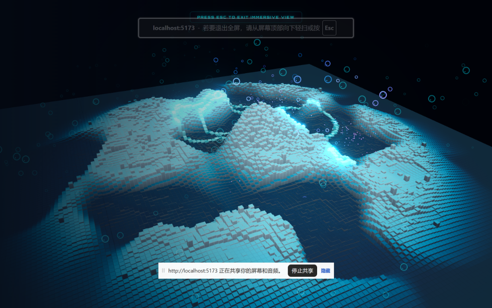
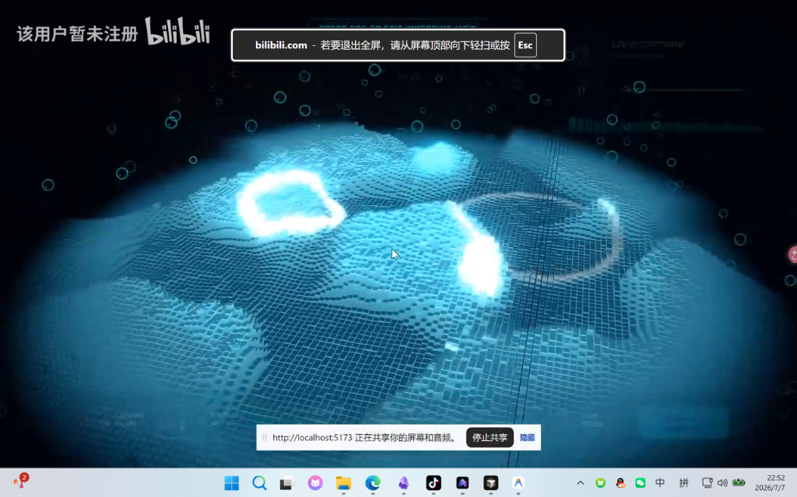

# Aether Voxel Tide (音律体素海)

一个基于 **Three.js (WebGL)**、**GLSL (自定义着色器材质)** 和 **Web Audio API** 构建的、具备高性能和未来科技感的网页端实时三维音乐音频地貌可视化系统（Visualizer）。

---

## 🌟 视觉效果展示

### 最终调试完成：深邃霓虹海蓝 + 高反差声纳白波
我们成功移除了繁杂突兀的写实水波焦散线，还原了干净、纯粹的赛博自发光网格。深邃的海蓝色体素块与扫过海面的明亮白色声纳波纹形成了极具交互美感的视觉反差：


### 以前版本效果对照
本项目是作者此前制作的 3D 音乐可视化地貌的恢复与重构版，通过纯色发光顶面与向外扩散的同心圆涟漪波纹，赋予了体素方块液态的生命力：


---

## 🚀 核心特性

* **GPU 硬件加速渲染**：利用 `THREE.InstancedMesh` 一次性向 GPU 提交数万个立方体网格（仅需 1 次 Draw Call）。将所有的顶点高度偏置（噪波大陆与声纳涟漪计算）完全卸载至 GPU 顶点着色器（Vertex Shader）执行，保证在普通显卡或核显上也能稳定跑满 60 FPS。
* **物理波包声纳（Wave Packet）**：涟漪效果非普通的单层圆环，而是基于物理规律的一阶余弦载波与高斯衰减包络线复合算法：
  $$z_{ripple} = \cos(\Delta d \cdot 1.5) \cdot e^{-\frac{\Delta d^2}{w}}$$
  这使得声纳涟漪在扩散时，方块会产生带有连续波峰与波谷的物理震荡，动态自然逼真。
* **多频段音频信号解耦**：利用 Web Audio 对捕获的音频进行实时傅里叶变换，解耦出 Sub-Bass（超重低音，控制地貌中心抬升）到 Treble/Air（高音，控制星星点点的游离粒子闪烁）等共 8 个子频段，直接映射至地形起伏和粒子闪烁强弱。
* **双模式实时音频捕获**：既支持上传本地 `.mp3` / `.wav` 音轨进行离线解析，也支持利用浏览器底层的 Live Capture 模式实时捕获系统或麦克风的声浪输入。

---

## 🛠️ 技术栈

* **核心框架**：HTML5, CSS3, Javascript (ES6+)
* **3D 引擎**：Three.js (WebGL)
* **着色器语言**：GLSL
* **音频处理**：HTML5 Web Audio API (`AudioContext`, `AnalyserNode`)
* **构建打包**：Vite

---

## 📦 快速启动

### 前提条件

请确保你的本地环境已安装了 [Node.js](https://nodejs.org/)。

### 安装与运行

1. 克隆本项目：
   ```bash
   git clone https://github.com/Singularity-Ye/aether-voxel-tide.git
   cd aether-voxel-tide
   ```

2. 安装依赖：
   ```bash
   npm install
   ```

3. 启动开发服务器：
   ```bash
   npm run dev
   ```
   在浏览器中访问 [http://localhost:5173/](http://localhost:5173/) 即可体验。

4. 打包生产版本：
   ```bash
   npm run build
   ```
   打包产物将输出在根目录下的 `dist/` 目录中。

---

## ⚙️ 着色器宏定义配置

地形的渲染特征由片元着色器头部的宏定义直接控制。你可以在 [VoxelShaderMaterial.js](src/scene/VoxelShaderMaterial.js) 的片元着色器段通过注释宏来自由切换画面风格：

```glsl
#define ENABLE_STATIC_HEIGHT    // 开启静态双频 Simplex 噪波岛屿
#define ENABLE_IDLE_WAVE        // 开启海床的微弱呼吸起伏波浪
#define ENABLE_AUDIO_HEIGHT     // 开启音频驱动的体素列高度跳跃
#define ENABLE_RIPPLE_GEOMETRY  // 开启声纳波形几何起伏
#define ENABLE_RIPPLE_HIGHLIGHT // 开启同心圆波包高亮发光
//#define ENABLE_CAUSTICS       // 开启有机折射焦散（已注释，确保纯净的赛博网格质感）
```

---

## 📄 开源协议

本项目基于 MIT License 协议开源。
